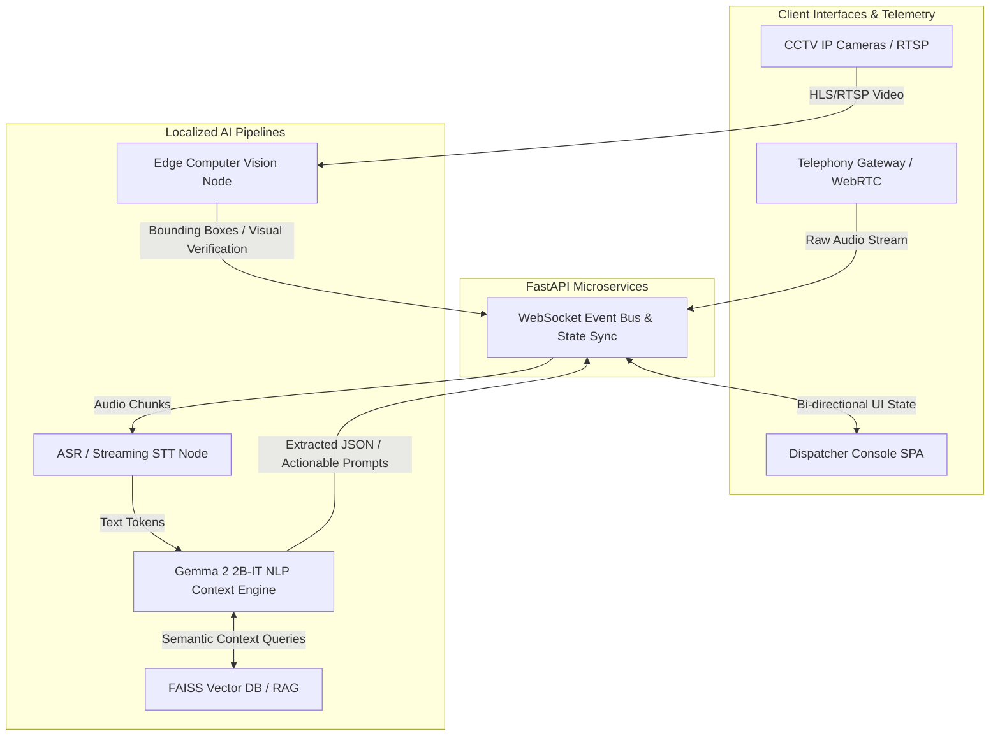
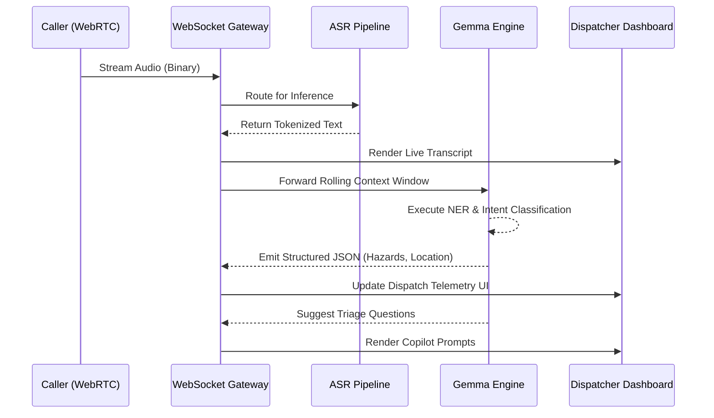
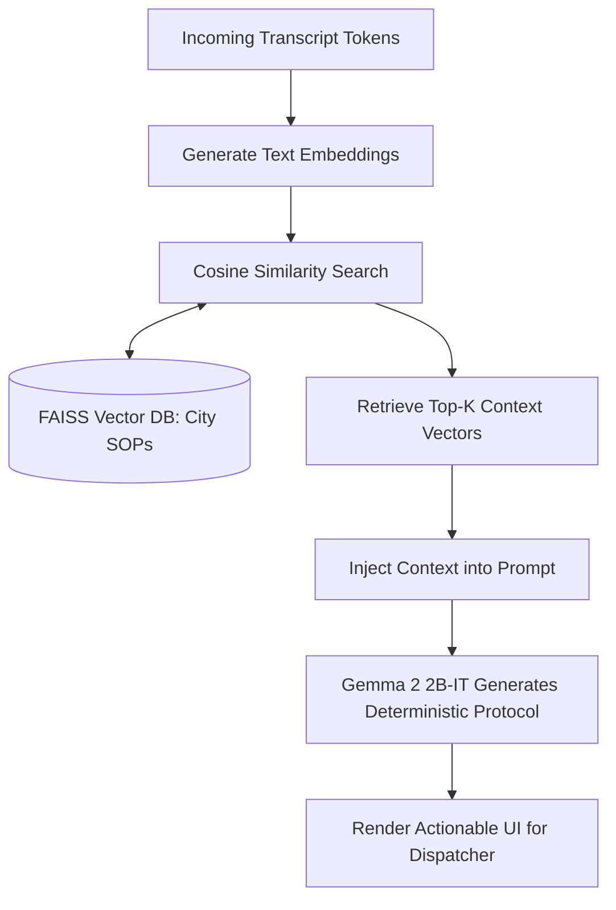

# E-mrg: Autonomous Multi-Modal Emergency Response Orchestrator

**Track:** Intelligence with Purpose
**Team:** DudeDevZZ

---

## Problem

Modern Public Safety Answering Points (PSAPs) rely on sequential, highly manual workflows that induce immense cognitive overload on human dispatchers. During high-stress 911 calls, operators must simultaneously execute complex auditory processing from panicked callers, manually transcribe critical telemetry (locations, hazards, victim counts), and mentally cross-reference this data with unit availability.

**The Bottleneck:** This manual process introduces an estimated 60-120 second latency before emergency units are dispatched. Informal observations suggest a notable increase in critical data omission during high-volume periods due to dispatcher fatigue. Furthermore, dispatchers operate entirely "blind" to the actual physical reality of the scene, relying solely on caller testimony, which can result in either over-dispatching (wasting municipal resources) or under-dispatching (endangering lives).

---

## Solution

**E-mrg** is an Event-Driven, AI-powered command center that acts as an autonomous "Copilot" for emergency operators. By running multi-modal distributed inference in parallel with the ongoing emergency call, E-mrg aims to eliminate the manual data-entry bottleneck.

From the moment a call connects, E-mrg streams the audio through a low-latency Speech-to-Text (STT) pipeline. The raw text tokens are instantly processed by our localized Large Language Model, which performs real-time Named Entity Recognition (NER), sentiment analysis, and intent classification to extract structured incident telemetry. Simultaneously, an edge-based Computer Vision node hooks into regional CCTV feeds to visually verify the incident (e.g., detecting fire, estimating vehicle collisions) via bounding-box overlap validation.

The dispatcher is presented with an intelligent, React-based UI that algorithmically clusters geospatial data and recommends the nearest response units, shifting the dispatcher's role from a reactive data-entry clerk to a strategic, fully-informed commander.

---

## How Gemma Is Used

- **Model variant:** Google Gemma 2 2B-IT (Quantized 4-bit / QLoRA optimized)
- **How it's used:** Gemma 2 2B-IT serves as the deterministic reasoning engine at the core of our AI Copilot. It operates as a localized RAG (Retrieval-Augmented Generation) agent that ingests a rolling context window of transcribed caller dialogue. In real-time, it executes zero-shot classification and Named Entity Recognition (NER) to output strict JSON schemas containing incident type, severity, and geospatial landmarks. Furthermore, it dynamically generates context-aware follow-up questions for the dispatcher to ask the caller, accelerating the triage process.
- **Why specific Gemma variant:** Emergency response systems demand stringent data handling (minimizing cloud API calls to protect sensitive PII/PHI) and ultra-low latency. The **Gemma 2 2B-IT** variant offers an ideal architectural sweet spot: its parameter footprint is lightweight enough to run locally on edge hardware, yet robust enough to handle complex semantic reasoning, multi-turn context retention, and precise JSON schema adherence required for medical triage.
- **Customization & Engineering:**
  1. **Prompt Engineering:** We utilized few-shot prompting techniques to constrain Gemma into a strict deterministic JSON-output mode, mitigating hallucinatory text generation.
  2. **RAG Pipeline:** We wired Gemma into a local FAISS Vector Database to execute semantic retrieval. By generating embeddings of localized municipal Standard Operating Procedures (SOPs), Gemma grounds its triage recommendations strictly in jurisdictional protocols, querying the cosine similarity between the live emergency transcript and the official dispatcher rulebook.

---

## Architecture

E-mrg relies on a decoupled, Event-Driven Microservices Architecture designed for fault tolerance and low latency. The frontend (Next.js) maintains asynchronous bidirectional WebSocket connections with a Python FastAPI backend, which acts as the orchestrator for the local inference mesh.

### Real-Time Inference & Event Sequence

### RAG-Powered SOP Retrieval Pipeline

**Tech stack:**

- **Frontend:** Next.js 15, React 19, Tailwind CSS, WebGL/Leaflet (Geospatial Mapping)
- **Backend:** Python 3.10+, FastAPI (asyncio), WebSockets
- **Inference Runtime:** Ollama (hosting Gemma 2 2B-IT), Deepgram (STT pipeline)
- **Persistence & Retrieval:** MongoDB (Event Sourcing/Logs), FAISS (High-dimensional Vector Search)
- **Deployment Target:** Dockerized containers orchestrated for localized Edge/On-Premise deployment (Zero-Trust architecture).

---

## Results / Demo

- **What it does well:** E-mrg streamlines the dispatch processing bottleneck through parallelized inference pipelines.
  - **Latency Target:** Designed with a target architecture goal of a transcription-to-insight latency of `<500ms`. At this threshold, the dispatcher views the extracted address and incident severity on their UI nearly concurrently with the caller's speech.
  - **Multi-Modal Verification:** Our architecture cross-references Gemma's NLP semantic extraction against the Computer Vision node's real-time bounding boxes (e.g., NLP extracts "Car Crash", Vision node validates `detected_vehicles >= 2`).
  - **Compliance Alignment:** By running Gemma locally on on-premise infrastructure, the system is designed to support HIPAA-aligned data handling, ensuring sensitive PII is kept off external commercial cloud providers.
- **Demo video:** [Link to Demo Video]
- **Screenshots:** *(Refer to the `images/` directory in our GitHub repository for high-res dashboard UI screenshots)*

---

## Links

- **GitHub repo:** https://github.com/tanushbhootra576/Emrg
- **License for this project:** MIT License

---

## Acknowledgments

- **Google / Kaggle:** For open-sourcing the Gemma weights, enabling high-performance Edge AI without cloud reliance.
- **Next.js & Tailwind Community:** For the unopinionated rendering engines that powered our high-contrast, low-latency command center UI.
