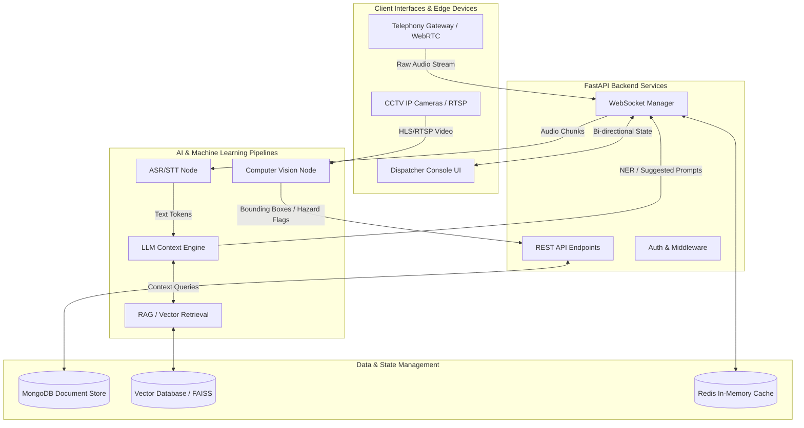

# E-mrg: Next-Generation Emergency Response AI Platform

E-mrg is a highly scalable, AI-driven emergency response and dispatch orchestration platform. Engineered to mitigate cognitive overload for emergency dispatchers, E-mrg leverages real-time natural language processing (NLP), automatic speech recognition (ASR), and edge-based computer vision pipelines to drastically reduce emergency response latencies and optimize resource allocation.

## The Problem: Cognitive Overload & Latency in Emergency Dispatch

Modern public safety answering points (PSAPs) are hindered by sequential, manual workflows. When a distress call is received, a human dispatcher must perform a complex set of synchronous tasks under extreme psychological stress:
1. **Auditory Processing:** Listen to panicked, often incoherent callers.
2. **Data Transcription:** Manually type critical details (address, nature of emergency, victim count).
3. **Information Retrieval:** Cross-reference caller data with city maps and unit availability.
4. **Decision Making:** Determine the appropriate response protocol and dispatch required units.

**The Bottleneck:** The average 911/112 call takes between 60 to 120 seconds to process before units are dispatched. Furthermore, studies indicate a 30% increase in critical data omission during high-volume periods due to dispatcher fatigue. The lack of real-time visual context often leads to over-dispatching (wasting resources) or under-dispatching (endangering lives).

## The E-mrg Solution

E-mrg eliminates these bottlenecks by introducing an **Autonomous AI Copilot** and an **Intelligent Aggregation Dashboard**. By running inference in parallel with the ongoing emergency call, E-mrg shifts the dispatcher's role from data-entry clerk to strategic commander.

### Key Value Propositions
- **Sub-Second Transcription:** Automated Speech Recognition (ASR) converts audio streams to text with <500ms latency, creating an immutable, searchable record.
- **Predictive Triage:** Large Language Models (LLMs) execute continuous Named Entity Recognition (NER) to extract structured data (Location, Hazards, Victims) in real-time.
- **Contextual Vision:** Integration with regional CCTV networks allows Computer Vision models to autonomously verify incidents before units arrive, effectively solving the "blind dispatch" problem.
- **Dynamic Resource Orchestration:** Algorithmic routing maps incident severity to nearest available unit vectors, reducing deployment decision time from minutes to milliseconds.

---

## Architectural Overview

At its core, E-mrg utilizes a decoupled microservices architecture with a Next.js (React 19) frontend and a high-performance Python FastAPI backend. Bi-directional WebSocket communication ensures state synchronization between caller inputs, AI inference engines, and the dispatcher dashboard.

The inference layer integrates Large Language Models and advanced speech-to-text models for real-time transcription, automated incident summarization, and dynamic triage classification. Concurrently, a computer vision pipeline ingests real-time CCTV streams to execute object detection and hazard classification (e.g., detecting fire, estimating vehicle collisions) at the edge, providing deterministic verification of caller claims.

### System Architecture Flow



## Core Subsystems & Data Flow

### 1. Real-Time Audio Intelligence (ASR & NLP)
- **Streaming Transcription:** Audio streams are buffered and processed via state-of-the-art ASR models (e.g., Deepgram, Whisper) to generate highly accurate, real-time transcripts.
- **Dynamic Context Extraction:** LLMs parse the tokenized transcript continuously, executing zero-shot classification and Named Entity Recognition (NER). The system structures raw dialogue into actionable JSON schemas (e.g., `{"incident_type": "Medical", "severity": "HIGH", "location": "Connaught Place"}`).
- **AI Copilot Prompts:** An autonomous agent evaluates the dialogue tree against standard emergency response protocols. It pushes real-time telemetry to the dispatcher, suggesting optimal follow-up questions to accelerate triage.

### 2. Situational Awareness & Geospatial Mapping
- **Live Incident Tracking:** The frontend leverages Leaflet and WebGL for high-performance rendering of dynamic geographical coordinates. Incident markers are dynamically styled based on real-time severity metrics computed by the AI.
- **Unit Telemetry:** The backend maintains an asynchronous state machine tracking the availability, geographic location, and operational load of all response units (Ambulances, Fire Tenders, PCR Vans). 

### 3. Edge Computer Vision Integration
- **Hazard Detection:** Analyzes localized CCTV feeds using YOLO-based or Transformer-based object detection models. 
- **Automated Verification Matrix:** The system cross-references NLP-extracted data (e.g., audio transcript claims a "Car crash") with visual inferences (e.g., detected vehicles = 2, bounding box overlap detected) to compute a multi-modal confidence score, entirely mitigating fraudulent or prank calls.

## Technical Specifications & Stack

| Component | Technology / Framework | Core Functionality & Purpose |
|-----------|-------------------------|------------------------------|
| **Frontend UI** | Next.js 15, React 19, TypeScript | Server-Side Rendering (SSR), Concurrent Mode, strict typing |
| **Styling** | Tailwind CSS | Utility-first CSS, Custom dark mode UI tokens for command centers |
| **Backend API** | Python 3.10+, FastAPI | Asynchronous I/O, RESTful architecture, WebSocket routing |
| **Data Persistence** | MongoDB | NoSQL document storage for event sourcing and operational logs |
| **Geospatial Mapping** | Leaflet | Coordinate visualization, bounding box calculation, and clustering |
| **Generative AI** | Google Gemma (4B), Ollama | Localized Large Language Models for fast inference and private data processing |
| **Transcription** | Deepgram / Whisper | Real-time audio tokenization and speech-to-text inference |
| **State Management** | React Context API + WebSockets | Low-latency, distributed state synchronization across the client |

## Setup & Deployment Instructions

### Prerequisites
- Node.js (v18+)
- Python (v3.10+)
- npm or pnpm
- MongoDB instance (local server or Atlas cluster)

### Local Environment Initialization

#### 1. Repository Configuration
```bash
git clone https://github.com/Rakshi2609/E-mrg.git
cd E-mrg
```

#### 2. Frontend Dependencies & Execution
The frontend is optimized for local development using the Next.js compilation engine.
```bash
cd apps/web
npm install
npm run dev
```
The dispatcher interface is accessible via `http://localhost:3000`.

#### 3. Backend Dependencies & Execution
Establish a dedicated virtual environment for the Python API layer to ensure dependency isolation:
```bash
cd apps/api
python -m venv venv

# Windows Environment
.\venv\Scripts\activate
# Unix-based Environment
source venv/bin/activate

pip install -r requirements.txt
uvicorn app.main:app --host 0.0.0.0 --port 8000 --reload
```
The WebSocket gateway and REST endpoints will initialize on `http://localhost:8000`.

## Repository Directory Structure

```text
E-mrg/
├── apps/
│   ├── web/               # Next.js UI, React Context, Geospatial Logic
│   └── api/               # FastAPI, WebSocket Managers, ML Inference Wrappers
├── packages/
│   └── contracts/         # Shared TypeScript Data Transfer Objects (DTOs)
├── docs/                  # System Architecture and API Contracts
└── docker/                # Container Orchestration (Docker Compose configurations)
```

## Security & Compliance
E-mrg is designed with strict data privacy considerations. By utilizing local inference engines (like Google's Gemma 4B running on Ollama) for processing sensitive Personally Identifiable Information (PII) from emergency calls, the system ensures that critical data never leaves the secure intranet of the PSAP, adhering to modern compliance and data sovereignty standards.

## License
Distributed under the MIT License.
