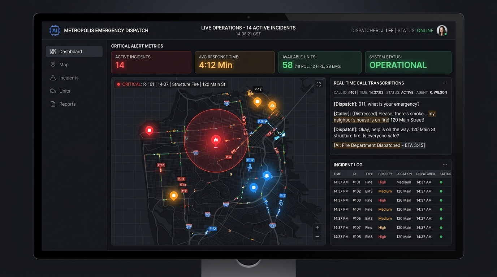

# E-mrg: Next-Generation Emergency Response AI



**E-mrg** is an AI-powered emergency response and dispatch platform designed to revolutionize how dispatchers handle 911/112 calls, manage live incidents, and deploy resources. By leveraging real-time audio transcription, intelligent AI copilot assistance, and CCTV integration, E-mrg drastically reduces response times and enhances situational awareness for emergency operators.

---

## ✨ Key Features

- **🎙️ Real-Time Call Transcription & AI Copilot**  
  Instantly transcribes emergency calls while an AI Copilot suggests questions, identifies the incident severity, and generates concise summaries for dispatchers.
  
- **🗺️ Live Incident Mapping**  
  Interactive geographical view of all active incidents, units, and camera feeds using Leaflet. Features live tracking with an optimized, premium dark-mode UI.
  
- **📹 CCTV Evidence & Analysis**  
  Integration with local camera feeds to automatically detect hazards (e.g., Fire, Traffic Accidents) and estimate the number of people or vehicles involved, providing critical visual context before first responders arrive.
  
- **🚓 Smart Unit Dispatching**  
  Automatically recommends the necessary units (Ambulances, Fire Tenders, PCR Vans) based on the AI-analyzed severity and incident type.
  
- **📊 Analytics & Audit Trails**  
  Comprehensive records and analytics dashboard for post-incident review, performance tracking, and system auditing.

---

## 🛠️ Technology Stack

**Frontend (Web App)**
- [Next.js 15](https://nextjs.org/) (App Router)
- React 19
- TypeScript
- Tailwind CSS
- Leaflet (Maps)
- Progressive Web App (PWA) Ready

**Backend (API)**
- Python 3
- FastAPI
- WebSockets for real-time bi-directional streaming

---

## 🚀 Getting Started

### Prerequisites
- Node.js (v18+)
- Python (v3.10+)
- npm or pnpm

### 1. Clone the repository
```bash
git clone https://github.com/Rakshi2609/E-mrg.git
cd E-mrg
```

### 2. Set up the Frontend (Web)
```bash
cd apps/web
npm install
npm run dev
```
The dashboard will be running at `http://localhost:3000`.

### 3. Set up the Backend (API)
Open a new terminal and navigate to the backend directory:
```bash
cd apps/api
python -m venv venv

# Windows
.\venv\Scripts\activate
# macOS/Linux
source venv/bin/activate

pip install -r requirements.txt
uvicorn app.main:app --reload
```
The API will be running at `http://localhost:8000`.

---

## 📁 Project Structure

This project is organized as a monorepo:

- `/apps/web/` - Next.js frontend application (Dispatcher Console, Map, Analytics)
- `/apps/api/` - Python FastAPI backend (WebSockets, AI Processing, DB connections)
- `/packages/contracts/` - Shared TypeScript interfaces and types

---

## 🎨 Design & UI
The application features a sleek, dark-themed UI tailored for command centers, utilizing the `Rajdhani` and `Inter` fonts for a high-tech, readable data display. The design emphasizes high contrast and clear visual hierarchy so dispatchers can parse critical information instantly.

---

## 📄 License
This project is licensed under the MIT License.
