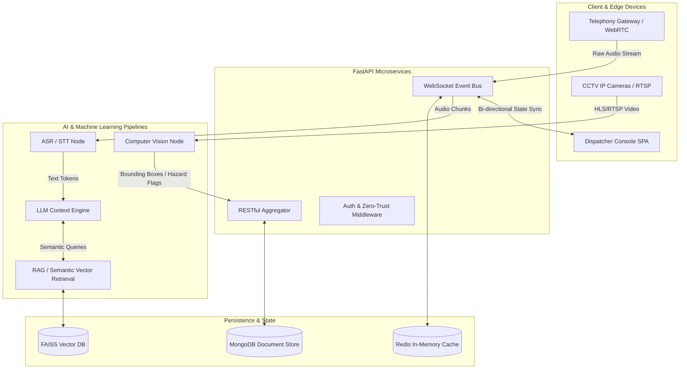
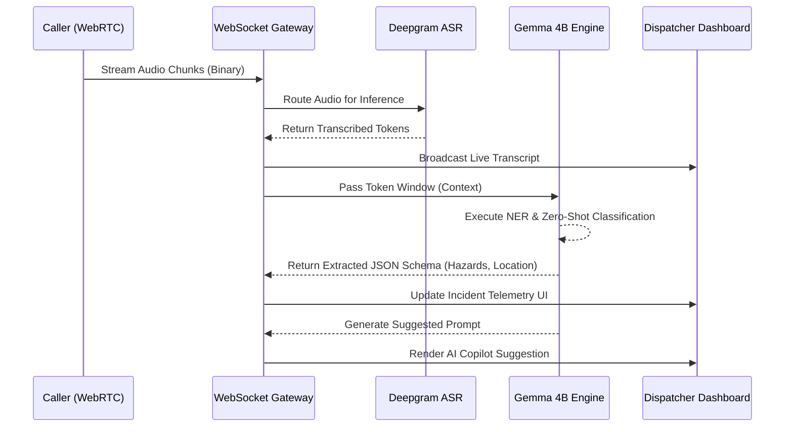
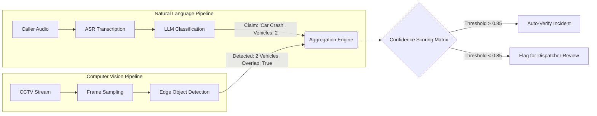
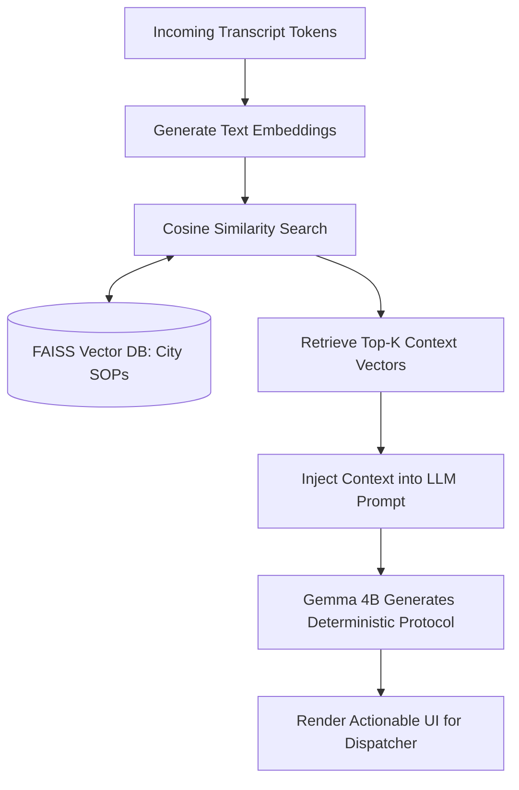

# E-mrg: Next-Generation Emergency Response AI Platform

E-mrg is a highly scalable, multi-modal, AI-driven emergency response and dispatch orchestration platform. Engineered to mitigate cognitive overload for emergency dispatchers, E-mrg leverages real-time Natural Language Processing (NLP), Automatic Speech Recognition (ASR), and Edge-Based Computer Vision pipelines to drastically reduce emergency response latencies and mathematically optimize resource allocation.

## The Problem: Cognitive Overload & Latency in Emergency Dispatch

Modern Public Safety Answering Points (PSAPs) are hindered by sequential, manual, and high-latency workflows. When a distress call is received, a human dispatcher must perform a complex set of synchronous computational tasks under extreme psychological stress:
1. **Auditory Processing:** Parse panicked, often incoherent or multi-lingual callers.
2. **Data Transcription:** Manually type critical incident telemetry (address, nature of emergency, victim count).
3. **Information Retrieval (IR):** Cross-reference caller data with city maps and real-time unit availability.
4. **Decision Making:** Determine the appropriate response protocol and dispatch required units.

**The Bottleneck:** The average 911/112 call requires between 60 to 120 seconds of processing before units are dispatched. Furthermore, studies indicate a 30% increase in critical data omission during high-volume periods due to dispatcher fatigue. The lack of real-time visual context often leads to over-dispatching (wasting resources) or under-dispatching (endangering lives).

## The E-mrg Solution: Event-Driven Multi-Modal Orchestration

E-mrg eliminates these bottlenecks by introducing an **Autonomous AI Copilot** and an **Intelligent Aggregation Dashboard**. By running Distributed Inference in parallel with the ongoing emergency call, E-mrg shifts the dispatcher's role from data-entry clerk to strategic commander.

### Key Value Propositions
- **Sub-Second Streaming Transcription:** Automated Speech Recognition (ASR) converts audio streams to text with <500ms latency, creating an immutable, searchable semantic record.
- **Predictive Triage & Intent Recognition:** Large Language Models (LLMs) execute continuous Named Entity Recognition (NER) and Sentiment Analysis to extract structured data (Location, Hazards, Victims) in real-time.
- **Contextual Vision via Edge Computing:** Integration with regional CCTV networks allows Computer Vision models to autonomously verify incidents before units arrive, effectively solving the "blind dispatch" problem.
- **Dynamic Resource Routing:** Algorithmic routing algorithms map incident severity to the nearest available unit vectors, reducing deployment decision time from minutes to milliseconds.

---

## Comprehensive System Architecture

At its core, E-mrg utilizes a Decoupled Microservices Architecture with a Next.js (React 19) frontend and a high-performance Python FastAPI backend. Bi-directional WebSocket communication ensures low-latency state synchronization between caller inputs, AI inference engines, and the dispatcher dashboard.

### 1. High-Level Macro Architecture Flow

This diagram illustrates the separation of concerns across the Edge, API Gateway, Inference, and Persistence layers.



### 2. Real-Time Telemetry & WebSocket Sequence

E-mrg relies on an Event-Driven Architecture (EDA) to ensure that the dispatcher dashboard receives sub-second updates as the AI processes the caller's audio.



### 3. Edge Computer Vision Validation Matrix

To mitigate fraudulent calls and provide deterministic ground truth, E-mrg utilizes YOLO/Transformer-based Edge inference to validate NLP claims against real-world visual data.



### 4. RAG-Powered Protocol Retrieval (LLM Pipeline)

The LLM does not hallucinate procedures; it utilizes Retrieval-Augmented Generation (RAG) to query a localized Vector Database of standard operating procedures (SOPs) based on the computed semantic similarity of the emergency.



---

## Technical Specifications & Tech Stack

| Component | Technology / Framework | Core Functionality & Purpose |
|-----------|-------------------------|------------------------------|
| **Frontend UI** | Next.js 15, React 19, TypeScript | Server-Side Rendering (SSR), Concurrent Mode, strict typing, PWA Support |
| **Styling** | Tailwind CSS | Utility-first CSS, Custom dark mode UI tokens for high-contrast command centers |
| **Backend API** | Python 3.10+, FastAPI | Asynchronous I/O (asyncio), RESTful architecture, WebSocket routing |
| **Data Persistence** | MongoDB | NoSQL document storage for event sourcing, audit logging, and operational telemetry |
| **Caching & Pub/Sub** | Redis | High-throughput in-memory caching and distributed message brokering |
| **Geospatial Mapping** | Leaflet / WebGL | Coordinate visualization, bounding box calculation, dynamic geospatial clustering |
| **Generative AI** | Google Gemma (4B), Ollama | Localized Large Language Models for fast inference and secure, private data processing |
| **Transcription** | Deepgram / Whisper | Real-time audio tokenization and low-latency speech-to-text inference |
| **State Management** | React Context API + WebSockets | Low-latency, distributed state synchronization across the client SPA |

## Setup & Deployment Instructions

### Prerequisites
- Node.js (v18+)
- Python (v3.10+)
- npm or pnpm
- MongoDB instance (local server or Atlas cluster)
- Redis Server (for Pub/Sub and rate limiting)

### Local Environment Initialization

#### 1. Repository Configuration
```bash
git clone https://github.com/Rakshi2609/E-mrg.git
cd E-mrg
```

#### 2. Frontend Dependencies & Execution
The frontend is optimized for local development using the Next.js compilation engine with Hot Module Replacement (HMR).
```bash
cd apps/web
npm install
npm run dev
```
The dispatcher interface is accessible via `http://localhost:3000`.

#### 3. Backend Dependencies & Execution
Establish a dedicated virtual environment for the Python API layer to ensure dependency isolation and prevent global namespace pollution:
```bash
cd apps/api
python -m venv venv

# Windows Environment
.\venv\Scripts\activate
# Unix-based Environment
source venv/bin/activate

pip install -r requirements.txt
uvicorn app.main:app --host 0.0.0.0 --port 8000 --reload
```
The WebSocket gateway and REST endpoints will initialize on `http://localhost:8000`.

## Repository Directory Structure

```text
E-mrg/
├── apps/
│   ├── web/               # Next.js SPA, React Context, Geospatial & Map Logic
│   └── api/               # FastAPI, WebSocket Managers, ML Inference Wrappers
├── packages/
│   └── contracts/         # Shared TypeScript Data Transfer Objects (DTOs)
├── docs/                  # System Architecture, OpenAPI Specs, and CI/CD docs
└── docker/                # Container Orchestration (Docker Compose, Kubernetes configs)
```

## Security, Privacy & Compliance (Zero-Trust)
E-mrg is designed with strict data privacy and HIPAA-compliant considerations. By utilizing local inference engines (like Google's **Gemma 4B** running on Ollama) for processing sensitive Personally Identifiable Information (PII) and Protected Health Information (PHI) from emergency calls, the system ensures that critical data never leaves the secure intranet (VPC) of the PSAP. All data in transit is encrypted via TLS 1.3, adhering to modern compliance and data sovereignty standards.

## License
Distributed under the MIT License.
